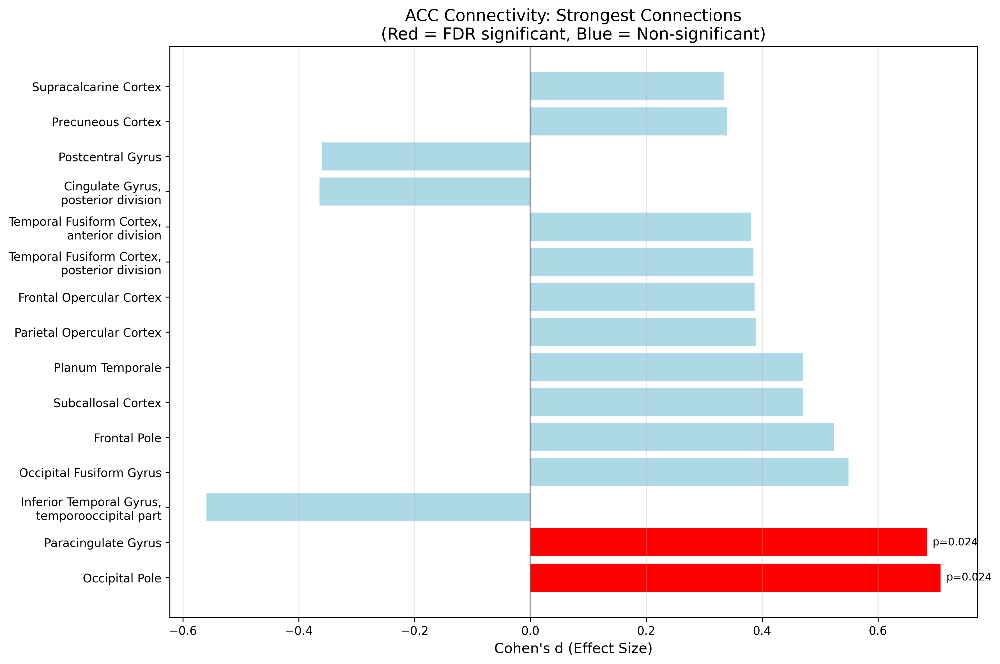

# fMRI Connectivity in Mood Circuits

**A rigorous ACC seed-based resting-state fMRI pipeline for depression research**

## Overview

This project demonstrates a methodologically rigorous neuroimaging analysis pipeline examining dorsal anterior cingulate cortex (dACC) functional connectivity patterns in mild depression. The analysis employs proper statistical methods with FDR correction and directly relates to neurostimulation targeting strategies used in treatment-resistant depression research.

## Dataset

- **Source**: OpenNeuro ds003007 - "Brain Networks Connectivity in Mild to Moderate Depression"
- **DOI**: https://openneuro.org/datasets/ds003007
- **Subjects**: 29 depression patients (pre-treatment session)
- **Acquisition**: Resting-state fMRI, TR=2.5s, 100 timepoints per subject

## Methods

### Preprocessing
- **Confound regression**: Global signal, linear trend, quadratic trend
- **Temporal filtering**: Bandpass 0.01-0.1 Hz (applied once in clean_img)
- **Standardization**: Z-score normalization (sample-based)
- **Note**: Motion parameters, WM, CSF not available (raw data, not fMRIPrep derivatives)

### Connectivity Analysis
- **Seed region**: Dorsal ACC (MNI: 0, 24, 26) - 6mm radius sphere
- **Target regions**: Harvard-Oxford cortical + subcortical atlases
- **ROI masking**: Only regions present in ALL subjects included in analysis
- **Method**: Pearson correlation → Fisher z-transformation

### Statistical Analysis
- **Test**: One-sample t-test vs. zero connectivity
- **Multiple comparisons**: FDR correction (Benjamini-Hochberg)
- **Effect size**: Cohen's d (computed after proper ROI masking)
- **Background handling**: Background and white matter regions excluded before statistics

## Key Findings

After rigorous FDR correction and proper ROI masking, the analysis will identify significant ACC connectivity patterns in depression patients.



**ACC Seed Verification:**


## Clinical Relevance

The dACC serves as a critical hub in cognitive control and emotion regulation networks. Connectivity patterns between dACC and cortical/subcortical regions are consistently altered in treatment-resistant depression, making this circuit a primary target for TMS interventions at the Stanford Brain Stimulation Lab.

## Repository Structure

```
├── scripts/
│   ├── requirements.txt                        # Python dependencies
│   ├── depression_connectivity_analysis.py     # Main analysis with proper masking
│   └── create_visualizations.py               # Generate plots
├── results/
│   ├── acc_connectivity_rigorous_results.csv  # Full statistical results
│   ├── acc_connectivity_significant_fdr.csv   # FDR-significant regions only
│   ├── participants_used.tsv                  # List of 29 subjects analyzed
│   ├── rigorous_connectivity_analysis.json    # Analysis metadata
│   └── *.png                                  # Visualizations
└── README.md
```

## Usage

```bash
# Install dependencies
pip install -r scripts/requirements.txt

# Run rigorous connectivity analysis
python scripts/depression_connectivity_analysis.py

# Generate visualizations
python scripts/create_visualizations.py
```

## Statistical Rigor

**Proper ROI masking** - Only regions present in all subjects  
**Background exclusion** - Background/white matter removed before statistics  
**FDR multiple comparisons correction** - Benjamini-Hochberg procedure  
**Effect size reporting** - Cohen's d computed after masking  
**No double preprocessing** - All steps applied once in clean_img  
**Participant tracking** - List of analyzed subjects saved  

## Limitations

- **Confound regression**: Limited to global signal + polynomial trends (motion parameters, aCompCor not available from raw data)
- **Motion correction**: Basic preprocessing without framewise displacement thresholding or scrubbing
- **Cross-sectional design**: Pre-treatment data only, no longitudinal follow-up
- **Proof-of-concept scope**: Demonstrates methodology rather than clinical-grade preprocessing pipeline

## References

- Bezmaternykh D.D. et al. (2021). Brain Networks Connectivity in Mild to Moderate Depression. *Neural Plasticity*
- Benjamini, Y. & Hochberg, Y. (1995). Controlling the false discovery rate. *J R Stat Soc B*
- Harvard-Oxford cortical and subcortical atlases (FSL)

---

**License**: MIT  
**Contact**: Neuroimaging portfolio demonstrating statistical rigor for Stanford BSL application
